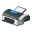

## ⤹ New Page
	 `DefaultIconTypes.NewPage` | `000`
## ⤹ Rich Text Document
	 `DefaultIconTypes.RichTextDocument` | `001`
## ⤹ Executable
	 `DefaultIconTypes.Executable` | `002`
## ⤹ Folder Open
	 `DefaultIconTypes.FolderOpen` | `003`
## ⤹ Folder Open1
	 `DefaultIconTypes.FolderOpen1` | `004`
## ⤹ Drive Floppy
	 `DefaultIconTypes.DriveFloppy` | `005`
## ⤹ Drive Floppy Save
	 `DefaultIconTypes.DriveFloppySave` | `006`
## ⤹ Drive
	 `DefaultIconTypes.Drive` | `007`
## ⤹ Drive1
	 `DefaultIconTypes.Drive1` | `008`
## ⤹ Drive Battery
	 `DefaultIconTypes.DriveBattery` | `009`
## ⤹ Drive Error
	 `DefaultIconTypes.DriveError` | `010`
## ⤹ Drive CD ROM
	 `DefaultIconTypes.DriveCDROM` | `011`
## ⤹ Chip
	 `DefaultIconTypes.Chip` | `012`
## ⤹ Dual Monitor Battery
	 `DefaultIconTypes.DualMonitorBattery` | `013`
## ⤹ Earth And Mouse Web
	 `DefaultIconTypes.EarthAndMouseWeb` | `014`
## ⤹ Monitor And Keyboard
	 `DefaultIconTypes.MonitorAndKeyboard` | `015`
## ⤹ Printer
	 `DefaultIconTypes.Printer` | `016`
## ⤹ Monitor And Earth Web
	 `DefaultIconTypes.MonitorAndEarthWeb` | `017`
## ⤹ Three Monitor Network
	 `DefaultIconTypes.ThreeMonitorNetwork` | `018`
## ⤹ Grid Folder
	 `DefaultIconTypes.GridFolder` | `019`
## ⤹ File Clock
	 `DefaultIconTypes.FileClock` | `020`
## ⤹ Control Panel
	 `DefaultIconTypes.ControlPanel` | `021`
## ⤹ Magnifying Glass Search
	 `DefaultIconTypes.MagnifyingGlassSearch` | `022`
## ⤹ Help Info
	 `DefaultIconTypes.HelpInfo` | `023`
## ⤹ Run
	 `DefaultIconTypes.Run` | `024`
## ⤹ Monitor Old
	 `DefaultIconTypes.MonitorOld` | `025`
## ⤹ U S B Eject
	 `DefaultIconTypes.USBEject` | `026`
## ⤹ Button Warning
	 `DefaultIconTypes.ButtonWarning` | `027`
## ⤹ People Overlay
	 `DefaultIconTypes.PeopleOverlay` | `028`
## ⤹ Shortcut Overlay
	 `DefaultIconTypes.ShortcutOverlay` | `029`
## ⤹ X
	 `DefaultIconTypes.X` | `030`
## ⤹ Recycle Empty
	 `DefaultIconTypes.RecycleEmpty` | `031`
## ⤹ Recycle Full
	 `DefaultIconTypes.RecycleFull` | `032`
## ⤹ Dial Up Network Folder
	 `DefaultIconTypes.DialUpNetworkFolder` | `033`
## ⤹ Desktop
	 `DefaultIconTypes.Desktop` | `034`
## ⤹ Control Panel New
	 `DefaultIconTypes.ControlPanelNew` | `035`
## ⤹ Grid Folder1
	 `DefaultIconTypes.GridFolder1` | `036`
## ⤹ Printer Folder
	 `DefaultIconTypes.PrinterFolder` | `037`
## ⤹ Font Folder
	 `DefaultIconTypes.FontFolder` | `038`
## ⤹ Taskbar
	 `DefaultIconTypes.Taskbar` | `039`
## ⤹ CD ROM Music
	 `DefaultIconTypes.CDROMMusic` | `040`
## ⤹ Tree
	 `DefaultIconTypes.Tree` | `041`
## ⤹ Monitor And Folder
	 `DefaultIconTypes.MonitorAndFolder` | `042`
## ⤹ Star Gold
	 `DefaultIconTypes.StarGold` | `043`
## ⤹ Button Key
	 `DefaultIconTypes.ButtonKey` | `044`
## ⤹ Upload Folder
	 `DefaultIconTypes.UploadFolder` | `045`
## ⤹ Screen Re Image
	 `DefaultIconTypes.ScreenReImage` | `046`
## ⤹ Lock
	 `DefaultIconTypes.Lock` | `047`
## ⤹ Monitor And Webpage
	 `DefaultIconTypes.MonitorAndWebpage` | `048`
## ⤹ Search Directory Media
	 `DefaultIconTypes.SearchDirectoryMedia` | `049`
## ⤹ Printer Battery
	 `DefaultIconTypes.PrinterBattery` | `050`
## ⤹ Battery Folder
	 `DefaultIconTypes.BatteryFolder` | `051`
## ⤹ Printer New
	 `DefaultIconTypes.PrinterNew` | `052`
## ⤹ Printer Battery New
	 `DefaultIconTypes.PrinterBatteryNew` | `053`
## ⤹ Printer Save Floppy
	 `DefaultIconTypes.PrinterSaveFloppy` | `054`
## ⤹ Directory Media
	 `DefaultIconTypes.DirectoryMedia` | `055`
## ⤹ SV CD Video
	 `DefaultIconTypes.SVCDVideo` | `056`
## ⤹ Folder Full
	 `DefaultIconTypes.FolderFull` | `057`
## ⤹ Drive Question Mark
	 `DefaultIconTypes.DriveQuestionMark` | `058`
## ⤹ Drive DVD
	 `DefaultIconTypes.DriveDVD` | `059`
## ⤹ DVD
	 `DefaultIconTypes.DVD` | `060`
## ⤹ DVD RAM
	 `DefaultIconTypes.DVDRAM` | `061`
## ⤹ DVD RW
	 `DefaultIconTypes.DVDRW` | `062`
## ⤹ DVD R
	 `DefaultIconTypes.DVDR` | `063`
## ⤹ DVD ROM
	 `DefaultIconTypes.DVDROM` | `064`
## ⤹ DVD Add Music
	 `DefaultIconTypes.DVDAddMusic` | `065`
## ⤹ CD RW
	 `DefaultIconTypes.CDRW` | `066`
## ⤹ CD R
	 `DefaultIconTypes.CDR` | `067`
## ⤹ CD Burn
	 `DefaultIconTypes.CDBurn` | `068`
## ⤹ Disc
	 `DefaultIconTypes.Disc` | `069`
## ⤹ CD ROM
	 `DefaultIconTypes.CDROM` | `070`
## ⤹ File New Music
	 `DefaultIconTypes.FileNewMusic` | `071`
## ⤹ File New Picture
	 `DefaultIconTypes.FileNewPicture` | `072`
## ⤹ File New Video
	 `DefaultIconTypes.FileNewVideo` | `073`
## ⤹ File New Audio Video
	 `DefaultIconTypes.FileNewAudioVideo` | `074`
## ⤹ Folder Flat
	 `DefaultIconTypes.FolderFlat` | `075`
## ⤹ Folder Flat Open
	 `DefaultIconTypes.FolderFlatOpen` | `076`
## ⤹ Defender Shield
	 `DefaultIconTypes.DefenderShield` | `077`
## ⤹ Warning Yellow Triangle
	 `DefaultIconTypes.WarningYellowTriangle` | `078`
## ⤹ Blue Info I
	 `DefaultIconTypes.BlueInfoI` | `079`
## ⤹ Red Error X
	 `DefaultIconTypes.RedErrorX` | `080`
## ⤹ Golden Key
	 `DefaultIconTypes.GoldenKey` | `081`
## ⤹ Drive Storage
	 `DefaultIconTypes.DriveStorage` | `082`
## ⤹ Rename
	 `DefaultIconTypes.Rename` | `083`
## ⤹ Red X
	 `DefaultIconTypes.RedX` | `084`
## ⤹ DVD Video
	 `DefaultIconTypes.DVDVideo` | `085`
## ⤹ DVD Video1
	 `DefaultIconTypes.DVDVideo1` | `086`
## ⤹ Disc Audio
	 `DefaultIconTypes.DiscAudio` | `087`
## ⤹ DVD Video2
	 `DefaultIconTypes.DVDVideo2` | `088`
## ⤹ HD DVD Video
	 `DefaultIconTypes.HDDVDVideo` | `089`
## ⤹ BD Video
	 `DefaultIconTypes.BDVideo` | `090`
## ⤹ V CD Video
	 `DefaultIconTypes.VCDVideo` | `091`
## ⤹ DVD Plus R
	 `DefaultIconTypes.DVDPlusR` | `092`
## ⤹ DVD Plus RW
	 `DefaultIconTypes.DVDPlusRW` | `093`
## ⤹ Monitor And Keyboard1
	 `DefaultIconTypes.MonitorAndKeyboard1` | `094`
## ⤹ Black
	 `DefaultIconTypes.Black` | `095`
## ⤹ People
	 `DefaultIconTypes.People` | `096`
## ⤹ MP3 Player
	 `DefaultIconTypes.MP3Player` | `097`
## ⤹ Disc Box
	 `DefaultIconTypes.DiscBox` | `098`
## ⤹ Phone
	 `DefaultIconTypes.Phone` | `099`
## ⤹ Camera
	 `DefaultIconTypes.Camera` | `100`
## ⤹ Camcorder
	 `DefaultIconTypes.Camcorder` | `101`
## ⤹ MP3 Player And Earbuds
	 `DefaultIconTypes.MP3PlayerAndEarbuds` | `102`
## ⤹ Dual Monitor Transfer
	 `DefaultIconTypes.DualMonitorTransfer` | `103`
## ⤹ Dual Monitor Web Earth
	 `DefaultIconTypes.DualMonitorWebEarth` | `104`
## ⤹ Folder ZIP
	 `DefaultIconTypes.FolderZIP` | `105`
## ⤹ Black1
	 `DefaultIconTypes.Black1` | `106`
## ⤹ Drive Windows
	 `DefaultIconTypes.DriveWindows` | `107`
## ⤹ Drive Storage1
	 `DefaultIconTypes.DriveStorage1` | `108`
## ⤹ File Music
	 `DefaultIconTypes.FileMusic` | `109`
## ⤹ Folder Pictures
	 `DefaultIconTypes.FolderPictures` | `110`
## ⤹ Folder Pictures1
	 `DefaultIconTypes.FolderPictures1` | `111`
## ⤹ Folder Search
	 `DefaultIconTypes.FolderSearch` | `112`
## ⤹ Printer Add
	 `DefaultIconTypes.PrinterAdd` | `113`
## ⤹ Folder Tree
	 `DefaultIconTypes.FolderTree` | `114`
## ⤹ Black2
	 `DefaultIconTypes.Black2` | `115`
## ⤹ Projector Screen
	 `DefaultIconTypes.ProjectorScreen` | `116`
## ⤹ Printer Battery OK
	 `DefaultIconTypes.PrinterBatteryOK` | `117`
## ⤹ Printer Save OK
	 `DefaultIconTypes.PrinterSaveOK` | `118`
## ⤹ Printer New Battery Ok
	 `DefaultIconTypes.PrinterNewBatteryOk` | `119`
## ⤹ Printer New Ok
	 `DefaultIconTypes.PrinterNewOk` | `120`
## ⤹ Printer New Ok Alt
	 `DefaultIconTypes.PrinterNewOkAlt` | `121`
## ⤹ File Text Page Lined
	 `DefaultIconTypes.FileTextPageLined` | `122`
## ⤹ Letter Mail
	 `DefaultIconTypes.LetterMail` | `123`
## ⤹ File Picture
	 `DefaultIconTypes.FilePicture` | `124`
## ⤹ File Sheet Music
	 `DefaultIconTypes.FileSheetMusic` | `125`
## ⤹ File Video
	 `DefaultIconTypes.FileVideo` | `126`
## ⤹ People HD
	 `DefaultIconTypes.PeopleHD` | `127`
## ⤹ Shield Question Mark
	 `DefaultIconTypes.ShieldQuestionMark` | `128`
## ⤹ Shield Red X Error
	 `DefaultIconTypes.ShieldRedXError` | `129`
## ⤹ Shield Green Check OK
	 `DefaultIconTypes.ShieldGreenCheckOK` | `130`
## ⤹ Shield Yellow Exclamation Warning
	 `DefaultIconTypes.ShieldYellowExclamationWarning` | `131`
## ⤹ Drive HD DVD
	 `DefaultIconTypes.DriveHDDVD` | `132`
## ⤹ Drive BD
	 `DefaultIconTypes.DriveBD` | `133`
## ⤹ HD DVD ROM
	 `DefaultIconTypes.HDDVDROM` | `134`
## ⤹ HD DVD R
	 `DefaultIconTypes.HDDVDR` | `135`
## ⤹ HD DVD RAM
	 `DefaultIconTypes.HDDVDRAM` | `136`
## ⤹ BD ROM
	 `DefaultIconTypes.BDROM` | `137`
## ⤹ BD R
	 `DefaultIconTypes.BDR` | `138`
## ⤹ BD RE
	 `DefaultIconTypes.BDRE` | `139`
## ⤹ Drive Server
	 `DefaultIconTypes.DriveServer` | `140`
## ⤹ Drive Server1
	 `DefaultIconTypes.DriveServer1` | `141`
## ⤹ Drive Server3
	 `DefaultIconTypes.DriveServer3` | `142`
## ⤹ Drive Server4
	 `DefaultIconTypes.DriveServer4` | `143`
## ⤹ Drive Server5
	 `DefaultIconTypes.DriveServer5` | `144`
## ⤹ Drive Server6
	 `DefaultIconTypes.DriveServer6` | `145`
## ⤹ Drive Server7
	 `DefaultIconTypes.DriveServer7` | `146`
## ⤹ Drive Server8
	 `DefaultIconTypes.DriveServer8` | `147`
## ⤹ Drive Server9
	 `DefaultIconTypes.DriveServer9` | `148`
## ⤹ Drive Server10
	 `DefaultIconTypes.DriveServer10` | `149`
## ⤹ Drive Server11
	 `DefaultIconTypes.DriveServer11` | `150`
## ⤹ Drive Server12
	 `DefaultIconTypes.DriveServer12` | `151`
## ⤹ Drive Server13
	 `DefaultIconTypes.DriveServer13` | `152`
## ⤹ Drive Server14
	 `DefaultIconTypes.DriveServer14` | `153`
## ⤹ Drive Server15
	 `DefaultIconTypes.DriveServer15` | `154`
## ⤹ Drive Server16
	 `DefaultIconTypes.DriveServer16` | `155`
## ⤹ Drive Server17
	 `DefaultIconTypes.DriveServer17` | `156`
## ⤹ Drive Server18
	 `DefaultIconTypes.DriveServer18` | `157`
## ⤹ Drive Server19
	 `DefaultIconTypes.DriveServer19` | `158`
## ⤹ Drive Server20
	 `DefaultIconTypes.DriveServer20` | `159`
## ⤹ Blank
	 `DefaultIconTypes.Blank` | `160`
## ⤹ Blank1
	 `DefaultIconTypes.Blank1` | `161`
## ⤹ Blank2
	 `DefaultIconTypes.Blank2` | `162`
## ⤹ Music Box
	 `DefaultIconTypes.MusicBox` | `163`
## ⤹ Drive Unlocked
	 `DefaultIconTypes.DriveUnlocked` | `164`
## ⤹ Drive Locked Gold
	 `DefaultIconTypes.DriveLockedGold` | `165`
## ⤹ Drive Unlocked Warning
	 `DefaultIconTypes.DriveUnlockedWarning` | `166`
## ⤹ Drive Unlocked Windows
	 `DefaultIconTypes.DriveUnlockedWindows` | `167`
## ⤹ Drive Unlocked Windows Warning
	 `DefaultIconTypes.DriveUnlockedWindowsWarning` | `168`
## ⤹ Drive Unlocked Alt
	 `DefaultIconTypes.DriveUnlockedAlt` | `169`
## ⤹ Drive Locked Gold Alt
	 `DefaultIconTypes.DriveLockedGoldAlt` | `170`
## ⤹ Drive Unlocked Warning Alt
	 `DefaultIconTypes.DriveUnlockedWarningAlt` | `171`
## ⤹ Media Folder New File
	 `DefaultIconTypes.MediaFolderNewFile` | `172`
## ⤹ Green Check Circle OK
	 `DefaultIconTypes.GreenCheckCircleOK` | `173`
## ⤹ Button Black Play
	 `DefaultIconTypes.ButtonBlackPlay` | `174`
## ⤹ Folder Flat1
	 `DefaultIconTypes.FolderFlat1` | `175`
## ⤹ Folder Open2
	 `DefaultIconTypes.FolderOpen2` | `176`
## ⤹ Folder Full1
	 `DefaultIconTypes.FolderFull1` | `177`
## ⤹ Gold Lock
	 `DefaultIconTypes.GoldLock` | `178`
## ⤹ Blue Arrows Together
	 `DefaultIconTypes.BlueArrowsTogether` | `179`
## ⤹ Brown Briefcase
	 `DefaultIconTypes.BrownBriefcase` | `180`
